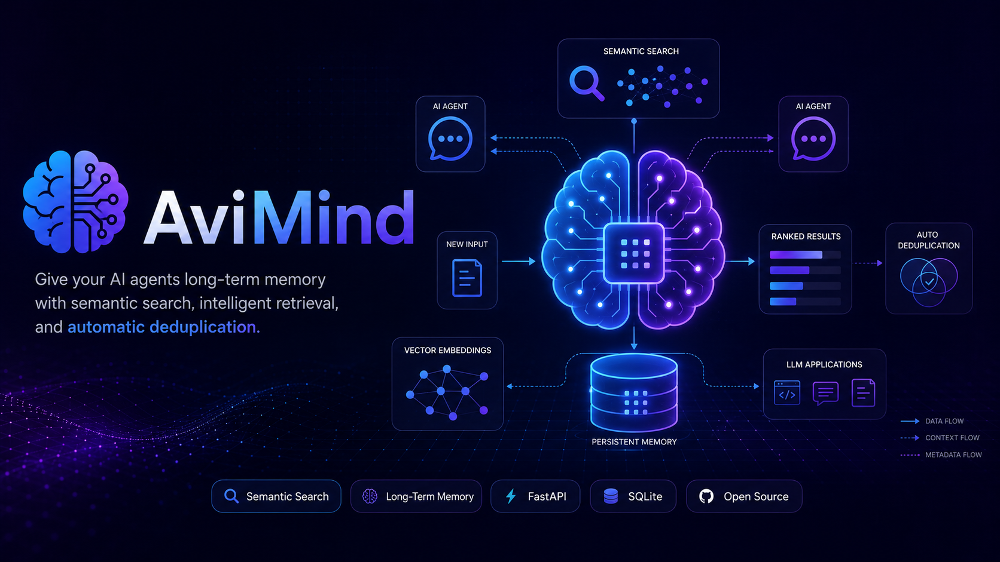

<p align="center">
  
</p>

# 🧠 AviMind


> **The open-source memory layer that gives AI agents long-term memory through semantic search, hybrid retrieval, intelligent ranking, and automatic deduplication.**

AviMind is an open-source persistent memory engine for AI agents and LLM-powered applications. It enables applications to remember user preferences, business context, conversations, and long-term knowledge across sessions.

Unlike traditional chat history, AviMind combines **semantic search**, **hybrid retrieval**, **keyword awareness**, and **memory importance scoring** to retrieve the most relevant context for your AI applications.

# 📦 Install

```bash
pip install avimind
```

Quick example:

```python
from avimind import AviMind

client = AviMind(
    base_url="http://localhost:8000"
)

client.remember(
    user_id="john",
    content="User prefers AWS Singapore."
)

print(
    client.context(
        user_id="john",
        query="Which cloud region does the user prefer?"
    )
)
```
> The Python SDK communicates with a running AviMind server.

---

# ✨ Features

* ✅ Persistent long-term memory
* ✅ Semantic search with embeddings
* ✅ Hybrid retrieval (semantic + keyword ranking)
* ✅ Automatic duplicate detection
* ✅ Memory importance scoring
* ✅ Intelligent context retrieval
* ✅ FastAPI REST APIs
* ✅ SQLite backend (zero configuration)
* ✅ Docker support
* ✅ Python SDK
* ✅ PostgreSQL backend
* ✅ Alembic database migrations
* 🚧 pgvector integration (planned)
* 🚧 Redis session memory (planned)


---

# 💡 Why AviMind?

Most AI agents forget everything after a conversation ends.

AviMind acts as a reusable memory layer that enables applications to remember:

* User preferences
* Business context
* Long-term facts
* Agent decisions
* Tool outputs
* Organizational knowledge
* Previous conversations

Instead of relying solely on exact keyword matching, AviMind uses embeddings and hybrid retrieval techniques to surface the most relevant memories automatically.

---

# 🚀 Example Use Cases

* AI chatbots with persistent memory
* Enterprise AI copilots
* Agentic workflows
* Customer support assistants
* Personal AI assistants
* Research assistants
* Knowledge management platforms
* LLM applications requiring long-term context

---

# ⚡ Quick Start

## Clone the repository

```bash
git clone https://github.com/avinashmhto/avimind.git

cd avimind
```

## Create a virtual environment

```bash
python -m venv .venv
```

### Windows (Git Bash)

```bash
source .venv/Scripts/activate
```

### Linux / macOS

```bash
source .venv/bin/activate
```

## Install dependencies

```bash
pip install -r requirements.txt
```

## Run AviMind Locally

```bash
uvicorn avimind_server.main:app --reload
```

Open Swagger UI:

```text
http://127.0.0.1:8000/docs
```

---

# 🐳 Run with Docker

Build and start AviMind:

```bash
docker compose up --build
```

Once the container is running, open:

```text
http://localhost:8000/docs
```

To stop the service:

```bash
docker compose down
```

AviMind uses SQLite by default for local development and also supports PostgreSQL for production deployments.

---

# 🐘 Using PostgreSQL

Configure a `.env` file:

```env
DB_ENGINE=postgres
DB_HOST=<host>
DB_PORT=5432
DB_NAME=avimind
DB_USER=<user>
DB_PASSWORD=<password>
...
```

Run database migrations:

```bash
alembic upgrade head
```

> AviMind automatically manages the database schema using Alembic migrations.

---

# 🐍 Python SDK

AviMind ships with a lightweight Python SDK that makes integration straightforward.

### Create a client

```python
from avimind import AviMind

client = AviMind(
    base_url="http://localhost:8000"
)
```

## Store a memory

```python
client.remember(
    user_id="avinash",
    agent_id="sdk-agent",
    session_id="chat-001",
    memory_type="profile_memory",
    content="User prefers AWS Singapore region.",
    tags=["aws", "preference"],
    importance=0.9,
)
```

## Search memories

```python
results = client.search(
    user_id="avinash",
    query="Which cloud region does the user prefer?"
)

print(results)
```

## Retrieve context

```python
context = client.context(
    user_id="avinash",
    query="Which cloud region does the user prefer?"
)

print(context)
```

## Health check

```python
print(client.health())
```

## Delete a memory

```python
client.delete("memory-id")
```

### Supported SDK methods

- `health()`
- `remember()`
- `search()`
- `context()`
- `delete()`

---

# 📝 Example

## Store a Memory

```json
{
  "user_id": "avinash",
  "agent_id": "goal-agent",
  "session_id": "goal-001",
  "memory_type": "goal_memory",
  "content": "User is building AviMind as an open-source persistent memory engine for AI agents.",
  "source": "manual",
  "created_by": "human",
  "tags": [
    "startup",
    "avimind",
    "opensource"
  ],
  "importance": 1.0
}
```

## Retrieve Context

**Query:**

```text
What startup is the user building?
```

**Response:**

```json
{
  "context": [
    "User is building AviMind as an open-source persistent memory engine for AI agents."
  ]
}
```

AviMind retrieves relevant memories using semantic understanding and hybrid ranking, even when the query wording differs from the original stored text.


---

# 🏗️ Core Capabilities

| Capability              | Status |
| ----------------------- | ------ |
| Persistent Memory       | ✅ |
| Semantic Search         | ✅ |
| Hybrid Retrieval        | ✅ |
| Automatic Deduplication | ✅ |
| Memory Ranking          | ✅ |
| Context Retrieval       | ✅ |
| FastAPI REST API        | ✅ |
| SQLite Backend          | ✅ |
| PostgreSQL Backend      | ✅ |
| Alembic Migrations      | ✅ |
| Docker Support          | ✅ |
| Python SDK              | ✅ |
| pgvector Integration    | 🚧 Planned |
| Redis Session Memory    | 🚧 Planned |

---

# 🚧 Current Status

**Version:** `0.5.0`

Implemented:

* Persistent memory storage
* Semantic search
* Hybrid retrieval
* Automatic duplicate detection
* Memory importance scoring
* Context retrieval APIs
* SQLite backend
* PostgreSQL backend
* Alembic migrations
* Docker support
* Python SDK
* REST APIs with Swagger
* Published on PyPI

---

# 🛣️ Roadmap

## v0.6

- Memory update APIs
- Memory listing APIs
- Authentication support
- Async Python SDK
- Batch memory APIs

## v0.7

- pgvector integration
- Native vector similarity search
- Vector indexing
- Performance optimizations

## v1.0

- Redis session memory
- Multi-tenant support
- OpenAI integration
- Ollama integration
- LangGraph integration
- MCP compatibility
- Cloud deployment guides


---

# 🤝 Contributing

Contributions, ideas, feature requests, and pull requests are welcome.

If AviMind helps your AI applications become smarter and more context-aware, please consider giving the project a ⭐ on GitHub.

---

# 📄 License

Released under the MIT License.

---

# 👨‍💻 Author

**Avinash Mahto**

Building practical infrastructure for AI agents, enterprise GenAI, cloud-native platforms, and intelligent memory systems.
