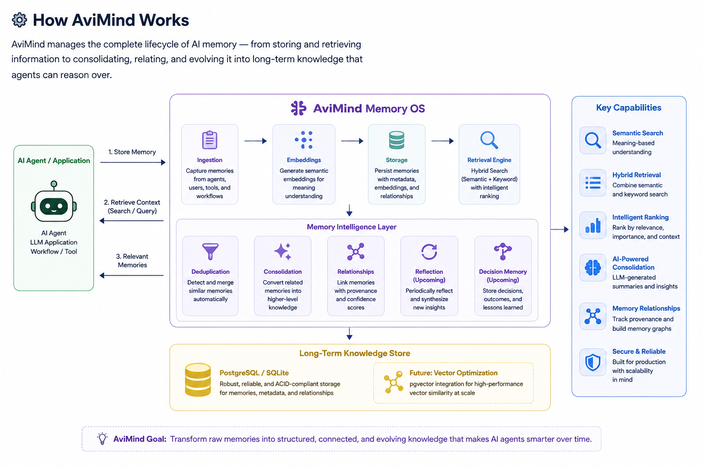

<p align="center">
  
</p>

# 🧠 AviMind


> **The Open-Source Memory OS for AI Agents.**
>
> **AviMind enables AI agents to remember, reason, consolidate knowledge, and continuously evolve long-term intelligence across conversations, workflows, and applications.**

Unlike traditional vector stores and memory libraries that primarily focus on storing and retrieving embeddings, AviMind manages the complete lifecycle of AI memory—from remembering and retrieval to consolidation, reflection, reasoning, and long-term knowledge evolution.

Built on semantic search, hybrid retrieval, intelligent ranking, and AI-powered memory intelligence, AviMind helps agents retain meaningful context across sessions instead of simply storing conversation history.

# 📦 Install

```bash
pip install avimind
```

Quick example:

```python
from avimind import AviMind

client = AviMind(
    base_url="http://localhost:8000"
)

client.remember(
    user_id="john",
    content="User prefers AWS Singapore."
)

print(
    client.context(
        user_id="john",
        query="Which cloud region does the user prefer?"
    )
)
```
> The Python SDK communicates with a running AviMind server.

---

# ✨ Features

* ✅ Persistent long-term memory
* ✅ Semantic search with embeddings
* ✅ Hybrid retrieval (semantic + keyword ranking)
* ✅ Automatic duplicate detection
* ✅ Memory importance scoring
* ✅ Intelligent context retrieval
* ✅ Memory lifecycle management
* ✅ Memory update & versioning
* ✅ Memory relationships (graph foundation)
* ✅ AI-powered memory consolidation
* ✅ LLM-generated long-term summaries
* ✅ FastAPI REST APIs
* ✅ SQLite backend
* ✅ PostgreSQL backend
* ✅ Alembic migrations
* ✅ Docker support
* ✅ Python SDK
* ✅ LLM Integration

### Coming Next

* 🚧 Reflection Engine
* 🚧 Decision Memory
* 🚧 Episodic Memory
* 🚧 Procedural Memory
* 🚧 Memory Graph
* 🚧 Multi-Agent Memory
* 🚧 pgvector optimization

# ⚙️ How AviMind Works

<p align="center">
  
</p>

AviMind manages the complete lifecycle of AI memory—from remembering and retrieval to consolidation, reflection, reasoning, and long-term knowledge evolution.

---

# 💡 Why AviMind?

AviMind acts as a Memory OS for AI Agents, providing a unified platform to store, retrieve, consolidate, organize, and evolve long-term knowledge.

Instead of treating memory as static storage, AviMind continuously transforms related memories into higher-level knowledge that agents can reason over.

# 🧠 Memory Intelligence

Traditional memory libraries primarily focus on storing and retrieving vectors.

AviMind goes beyond storage by transforming raw memories into structured long-term knowledge.

Today AviMind can:

- Consolidate similar memories into higher-level knowledge
- Generate AI-powered memory summaries
- Preserve provenance through memory relationships
- Archive redundant memories
- Maintain an evolving long-term memory store

Future versions will introduce Reflection, Decision Memory, Episodic Memory, Procedural Memory, and Memory Graphs—allowing AI agents to continuously learn from experience rather than simply storing information.

---

# 🚀 Example Use Cases

* AI chatbots with persistent memory
* Enterprise AI copilots
* Agentic workflows
* Customer support assistants
* Personal AI assistants
* Research assistants
* Knowledge management platforms
* LLM applications requiring long-term context

---

# ⚡ Quick Start

## Clone the repository

```bash
git clone https://github.com/avinashmhto/avimind.git

cd avimind
```

## Create a virtual environment

```bash
python -m venv .venv
```

### Windows (Git Bash)

```bash
source .venv/Scripts/activate
```

### Linux / macOS

```bash
source .venv/bin/activate
```

## Install dependencies

```bash
pip install -r requirements.txt
```

## Run AviMind Locally

```bash
uvicorn avimind_server.main:app --reload
```

Open Swagger UI:

```text
http://127.0.0.1:8000/docs
```

---

# 🐳 Run with Docker

Build and start AviMind:

```bash
docker compose up --build
```

Once the container is running, open:

```text
http://localhost:8000/docs
```

To stop the service:

```bash
docker compose down
```

AviMind uses SQLite by default for local development and also supports PostgreSQL for production deployments.

---

# 🐘 Using PostgreSQL

Configure a `.env` file:

```env
DB_ENGINE=postgres
DB_HOST=<host>
DB_PORT=5432
DB_NAME=avimind
DB_USER=<user>
DB_PASSWORD=<password>
...
```

Run database migrations:

```bash
alembic upgrade head
```

> AviMind automatically manages the database schema using Alembic migrations.

---

# 🐍 Python SDK

AviMind ships with a lightweight Python SDK that makes integration straightforward.

### Create a client

```python
from avimind import AviMind

client = AviMind(
    base_url="http://localhost:8000"
)
```

## Store a memory

```python
client.remember(
    user_id="avinash",
    agent_id="sdk-agent",
    session_id="chat-001",
    memory_type="profile_memory",
    content="User prefers AWS Singapore region.",
    tags=["aws", "preference"],
    importance=0.9,
)
```

## Search memories

```python
results = client.search(
    user_id="avinash",
    query="Which cloud region does the user prefer?"
)

print(results)
```

## Retrieve context

```python
context = client.context(
    user_id="avinash",
    query="Which cloud region does the user prefer?"
)

print(context)
```

## Health check

```python
print(client.health())
```

## Delete a memory

```python
client.delete("memory-id")
```

### Supported SDK methods

- `health()`
- `remember()`
- `list()`
- `get()`
- `update()`
- `delete()`
- `search()`
- `context()`

# 🌐 REST APIs

```text
GET    /health

POST   /memory
GET    /memory
GET    /memory/{id}
PATCH  /memory/{id}
DELETE /memory/{id}

GET    /memory/search
GET    /memory/context

POST   /memory/consolidate
```

### Coming Soon

- `consolidate()`
- `reflect()`

---

# 📝 Example

## Store a Memory

```json
{
  "user_id": "avinash",
  "agent_id": "goal-agent",
  "session_id": "goal-001",
  "memory_type": "goal_memory",
  "content": "User is building AviMind as an open-source persistent memory engine for AI agents.",
  "source": "manual",
  "created_by": "human",
  "tags": [
    "startup",
    "avimind",
    "opensource"
  ],
  "importance": 1.0
}
```

## Retrieve Context

**Query:**

```text
What startup is the user building?
```

**Response:**

```json
{
  "context": [
    "User is building AviMind as an open-source persistent memory engine for AI agents."
  ]
}
```

AviMind retrieves relevant memories using semantic understanding and hybrid ranking, even when the query wording differs from the original stored text.


---

# 🏗️ Core Capabilities

| Capability               | Status |
| ------------------------ | ------ |
| Persistent Memory        | ✅      |
| Semantic Search          | ✅      |
| Hybrid Retrieval         | ✅      |
| Automatic Deduplication  | ✅      |
| Memory Ranking           | ✅      |
| Context Retrieval        | ✅      |
| Memory Lifecycle         | ✅      |
| Memory Versioning        | ✅      |
| AI Memory Consolidation  | ✅      |
| LLM Memory Summarization | ✅      |
| Memory Relationships     | ✅      |
| FastAPI REST API         | ✅      |
| SQLite Backend           | ✅      |
| PostgreSQL Backend       | ✅      |
| Alembic Migrations       | ✅      |
| Docker Support           | ✅      |
| Python SDK               | ✅      |
| Reflection Engine        | 🚧     |
| Decision Memory          | 🚧     |
| Memory Graph             | 🚧     |
| Multi-Agent Memory       | 🚧     |


---

# 🚀 Current Status

**Version:** `0.7.0`

### Currently Implemented

- Persistent Memory
- Semantic Search
- Hybrid Retrieval
- Memory Importance Scoring
- Automatic Deduplication
- Memory Lifecycle Management
- Memory Updates
- Soft Delete
- Memory Versioning
- AI-powered Memory Consolidation
- LLM-generated Consolidated Memories
- Memory Relationships
- SQLite
- PostgreSQL
- Alembic
- Docker
- Python SDK
- FastAPI APIs
- Swagger Documentation

AviMind has now evolved from a persistent memory database into a Memory OS foundation capable of transforming raw memories into higher-level long-term knowledge.

---

# 🛣️ Roadmap

## v0.8 — Reflection Engine

- Automatic memory reflection
- Periodic knowledge synthesis
- Long-term memory compression
- Memory promotion
- Memory archival

---

## v0.9 — Memory Intelligence

- Decision Memory
- Episodic Memory
- Semantic Memory
- Procedural Memory
- Goal Memory
- Task Memory

---

## v1.0 — Memory Intelligence Platform

- Knowledge Graph
- Memory Relationships
- Reflection Engine
- Decision Memory
- Episodic Memory
- Procedural Memory
- Agent Reasoning

---

## v1.1 — Multi-Agent Memory

- Shared memory
- Team memory
- Organization memory
- Agent collaboration

---

## Future Vision

AviMind aims to become the Memory OS for AI Agents—providing a unified memory layer where agents can remember, reason, learn, reflect, make decisions, and continuously improve over time.


---

# 🤝 Contributing

Contributions, ideas, feature requests, and pull requests are welcome.

If AviMind helps your AI applications become smarter and more context-aware, please consider giving the project a ⭐ on GitHub.

---

# 📄 License

Released under the MIT License.

---

# 👨‍💻 Author

**Avinash Mahto**

Building practical infrastructure for AI agents, enterprise GenAI, cloud-native platforms, and intelligent memory systems.
